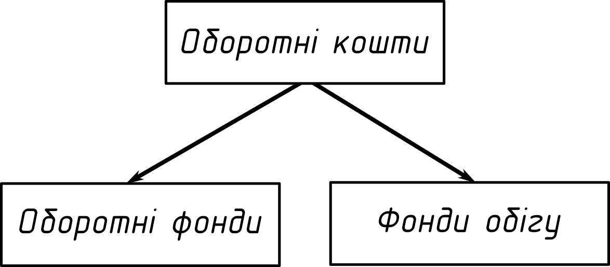

# Лекція 3. Оборотні кошти підприємства

1. Поняття оборотних коштів.
2. Показники використання оборотних коштів.
3. Формування оборотних коштів.

## Оборотні кошти

__Оборотні кошти__ --- це сукупність коштів підприємства, що авансуються на створення оборотних
фондів та фондів обігу і забезпечення їх неперервного обігу.

У своєму кругообігу оборотні кошти проходять послідовно три стадії:

- грошову -- підготовча, де гроші перетворюються у виробничі запаси;
- виробничу -- безпосередній процес виробництва де результатом є випуск готової продукції;
- товарну -- авансова оборотні кошти виступають у вигляді готової продукції.

### Класифікація оборотних коштів

1. За джерелами формування:
- власні і прирівняні до них;
- позичені (кредити в банків);
- залучені (наприклад додатковий випуск акцій).
2. За способами планування і нормування:
- нормовані;
- не нормовані.
3. За рівнем ліквідності:
- високоліквідні (гроші);
- швидколіквідні (дебіторська заборгованість);
- повільно ліквідні (виробничі запаси).

## Оборотні фонди

__Оборотний фонд__ --- частина виробничих доходів яка повністю споживається в кожному виробничому циклі виготовленої
продукції та повністю переносить свою вартість на вартість виготовленої продукції.

Оборотні фонди у своїй речовій формі утворюють _предмети праці_.

Склад оборотних фондів:

- виробничі запаси: сировина, основні та допоміжні матеріали, куповані напівфабрикати та
комплектуючі вироби, паливо, тара і тарні матеріали, запасні частини для ремонту, інші
матеріали;
- незавершене виробництво --- сировина що підлягає подальшій обробці ;
- витрати майбутніх періодів --- витрати підприємством на придбання необхідних для виробництва
активів які поки що не надійшли на підприємств.

## Фонди обігу

Фонди обігу пов'язані з обслуговуванням процесів обігу товарів. Вони не беруть участі у створенні
вартості, а є її носіями. До них належать До них належать: готова продукція на складі підприємства,
готова продукція, яка відвантажена і перебуває в дорозі, грошові кошти на розрахунковому та інших
рахунках, грошові кошти у незакінчених рахунках, готівка в касі.

## Показники використання оборотних коштів

### Коефіцієнт оборотності

Показує кількість обертів які здійснюються коштами з плановий період.

$$K_\text{об} = \frac{\text{РП}}{\bar{O}_\text{к}}$$

\begin{itemize}
\item [Де: ] $\text{РП}$ --- реалізована продукція;
\item [] $\bar{O}_\text{к}$ --- середній за період залишок оборотних коштів;
\end{itemize}

### Тривалість одного обороту

Це тривалість повного кругообігу з моменти придбання оборотних коштів до виходу та реалізації готової
продукції.

$$T_\text{об} = \frac{360\text{~днів}}{\text{K}_\text{об}}$$

## Нормування оборотних коштів

__Нормування оборотних коштів__ --- це визначення у потребі нормативних коштів.

### Методи нормування

1. Метод прямого розрахунку (ґрунтується на розрахунку нормативів за кожним нормованим елементом
оборотних коштів).
2. Аналітичний метод (застосовується коли не передбачається істотних змін в умовах роботи).
3. Коефіцієнтний (норматив визначений на базі попереднього нормативу шляхом внесення змін).
