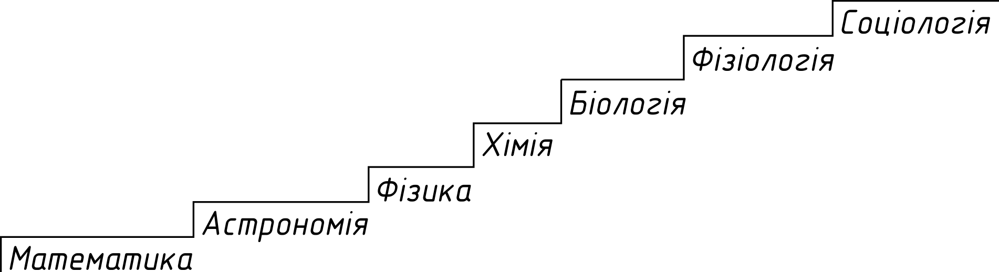

o# Лекція 2. 

## Епоха відродження

### Характерні риси епохи відродження

- апонтропоцентризм;
- орієнтація на мистецтво;
- гуманізм --- ставлення до людини, як до найвищої цінності;
- неоплатонізм (пантеїзм) --- Бог розчиняється в природі в наслідок чого природа обожнюється;
- секуляризація --- звільнення з під опіки церкви.

### Утопічні ідеї

- Англієць Томас Мор і його твір "Утопія";
- Італієць Томмазо Кампанелла --- "Місто сонця".

Утопія зображає ідеальне суспільство де немає приватної власності, а є обов’язкова праця всіх і
державне регулювання всіх стосунків.

Ніколо Макіавелі і його твір "Державець" (Государ/Князь)

- обов'язки держави --- захищати майнові і особисті права громадян, виражати інтереси громадянського
суспільства політична влада і політична діяльність в державі --- синоніми аморальності, адже в
суспільстві є або гнобитель, або гноблений
- Макіавеллі розробив принципи правління в державі

1. Авторитет лідера визначається підтримкою прихильників.
2. Підлеглі повинні знати чого вони можуть очікувати від свого лідера і розуміти чого він чекає від
них.
3. Лідер має володіти волею до виживання
4. Лідер має бути зразком мудрості і справедливості

Не важливо на яких засадах тримається влада правителя.

"Силу треба використовувати не часто, щоб страх не переріс у ненависть"

Правитель має поєднувати кілька засобів --- доброчинність і силу, але добро роздавати по краплі, щоб
підлеглі завжди були вдячні правителю. А карати повинен зразу і жорстоко. Бо моментна жорстокість
сприймається краще ніж розтягнута в часі.

Засоби Макіавелі:

- сила
- мудрість
- хитрість
- підлабузництво

В залежності від шляхів які, обирає правитель вони поділяються на левів і лисиць.

Рушійною силою суспільних відносин вважав егоїзм, і вважав що смерть батька особа переживає не так
болісно, як втрату власності.

## Протосоціологічні погляди нового часу (17-18ст)

### Томас Гобс

Томас Гобс _(16 -- 18 ст.)_ автор твору Левіафан --- морське чудовисько.

До виникнення держави люди перебували у стані загальної війни "всі проти всіх". Цей стан відповідав
егоїстичній природі людини, але природний розум змусив людей укласти суспільний договір для
забезпечення власної безпеки. Гарантією безпеки стала держава тобто Левіафан.

- Ефективна форма правління --- це абсолютна монархія.
- Свобода --- це право робити все, що не заборонено законом.
- Засуджує громадяньску війну.
- Структуру держави розглядав використовуючи принцип органіцизму.  Правитель це душа держави,
чиновники --- це нерви і сухожилля, виконавчі та судові органи --- суглоби, гроші --- це кров.

### Джон Лок.

Джон Лок --- основоположник доктрини лібералізму та концепції конституційно-парламентської монархії.

Основні тези:

- приватна власність --- це невід'ємна властивість індивідів, мета держави --- це захист власності.
- розпад держави не спричиняє розпаду суспільства
- суспільство --- це суспільна злагода, а не боротьба "всіх проти всіх".
- природна рівність людей забезпечується їх розумовою діяльністю
- державна влада поділяється на:
- законодавчу
- виконавчу
- федеральну

Люди передають урядові лише частину своїх природних прав. За собою залишають право на життя, працю і
власність. В разі невиконання владою своїх обов'язків народ має право розірвати з нею договір.

## Епоха просвітництва

1. Культ розуму (Раціоналізм)
2. Ідеал науковця і підприємства
3. Секуляризація
4. Атеїзм, Агностицизм, Деїзм (Бог створив світ, кинув нього людину і не втручається в закони
людського життя).
5. Віра в прогрес

### Монтеск'є

Написав трактат "Про дух законів". Розділяв владу на законодавчу, виконавчу і судову.

Виокремив держави за формами правління:

- монархії
- деспотії
- республіки
- демократичні
- аристократичні

Також встановив залежність форм правління від природно-кліматичних і географічних умов.

### Жан Жак Руссо

Автор праці "Суспільний договір".

## Класичний період розвитку соціології

### Огюст Конт

Основоположник соцілології, написав працю курс позитивної філософії у 6-ти томах, соціологію називає
соціальною фізикою і поділяє її на соціальну статику і соціальну динаміку.

Соціологія зоглядається як частина природознавства і ґрунтується на законах біології.

Найголовнішими методами Конт вважав спостереження та експеримент

Конт виділив 3 стадії розвитку пізнавальної діяльності:

1. Теологічна --- домінує релігійна міфологія, релігійні істоти;
2. Метафізична (1300 --- 1800) місце Бога посідає природа;
3. Позитивна стадія (після 1800).

### Герберт Спенсер

Основні тези:

- Прожив 83 роки;
- застосував принцип еволюції до розвитку суспільства.
