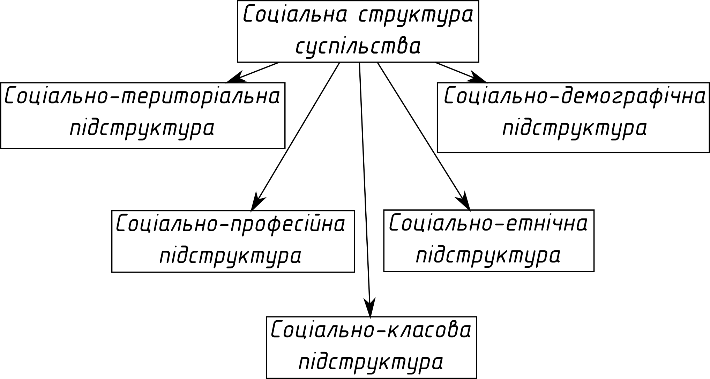

# Лекція 4

## Типи суспільств

В залежності від такої ознаки, як писемність, суспільство поділяються на дописемні і писемні.

Американьскі соціологи виділяють наступні типи:

1. Суспіольство мисливців і збирачів.
2. Садівничі суспільства
3. Аграрні.
4. Промислові

В залежності від розвиненості управління і ступеня соціального розшарування, суспільства бувають
_прості_ і _складні_.

За політичними режимами поділяються на _демократичні_, та _недемократичні_ (тоталітарні та
авторитарні).

За релігією: християнські, мусульманські.

Найпоширеніша класифікація (Рісман/Белл):

1. _Традиційне_ за Рісманом, або _доіндустріальне_ за Беллом.
2. Зуспільство кероване зсередини або _індустріальне_.
3. Суспільство кероване ззовні або _постіндустріальне_ (інформаційне).

Основні риси постіндустріального суспільства:

- у сфері послуг зайнято не менше 50% працюючого населення;
- головною складовою виробництва є інформація;
- розвитком управляє освіта.

Україна знаходиться в стані _посттоталітарного синдрому_.

## Соціальна структура суспільства

### Соціально-територіальна підструктура

Соціально-територіальна підструктура: це територіальні спільноти, міське і сільске наслення.

Останній перепис відбувся 5 грудня 2001 року. Найбільша чисельність населення України була в 1993
році --- 52,2 млн. 32 місце у світі за кількістю населення. 62,5% населення України проживає на місці
свого постійного проживання все життя.

Рівень урбанізації станом на 2014р --- 69%.

Найвищий в Україні рівень урбанізації в Донецькій (90,6%), Луганській (86,8%), Дніпровській (83,5%),
Харківській (80,2%) областях. Найменший в Закарпатській (36,8%), Чернівецькій (42,3%),
Івано-Франківській (43%), Тернопільській (44%).

Рівень урбанізації в Житомирській області становить 58,4%.

- Київ (2 млн 869 тис. осіб);
- Харків (1 млн 451 тис. осіб);
- Одеса (1 млн 17 тис. осіб);
- Дніпро (993 тис. осіб);
- Донецьк (950 тис. осіб);
- Житомир (271 тис. осіб).

### Соціально-професійна підструктура

Соціально-професійна підструктура --- це сукупність існуючих у суспільстві професійних груп та
відносин між ними.

### Соціально-класова підструктура

__Класи__ --- це великі групи людей які розрізняються за їх місцем в історично-визначеній системі
суспільного виробництва, за їх відношенням до засобів виробництва, за їх роллю в суспільній
організації праці, а значить і за способами та розмірами одержання цієї частки суспільного
багатства яка є в їх розпорядженні.

Ознаки класів:

- відношення до власності (володіє чи не володіє);
- роль в суспільному розподілі праці (фізична чи розумова);
- способи отримання і розміри доходів.

Марксисти виділяли також між класовий прошарок --- _інтелігенцію_, тобто людей професійно зайнятих
творчою працею. Окремо виділяли декласовані елементи (безхатченки, вбивці).

Поділ суспільства на вертикально розташовані соціальні групи і верстви називається --- __вертикальна
стратифікація__.

Англійський соціолог Ентоні Гідденс розрізняв 4 основні типи стратифікованого суспільства:

1. Рабство;
2. Касти;
3. Стани;
4. Класи.

Типи 1-3 називаються закритими.

Сучасні соціологи стверджують, що існують 3 класи:

1. Вищий;
2. Середній;
3. Нижчий.

### Соціально-етнічна підструктура

Соціально-етнічна підструктура нації, етноси, що проживають на цій території.

Українці становлять 77,8% населення України(за переписом 89-72,7%), росіяни 17,3%, поляки 0,3%, євреї 0,2%, німці
0,1%, молдавани + румуни 0,01.

